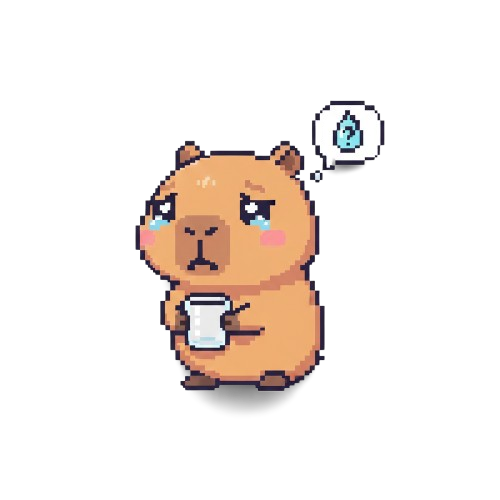

# 🦦 CapiWater

O **CapiWater** é um assistente de produtividade e hidratação para desktop, desenvolvido para garantir que profissionais de tecnologia mantenham o hábito de beber água enquanto focam em suas rotinas de código. O projeto utiliza uma abordagem de "Desktop Pet" interativo, unindo funcionalidade técnica com uma interface lúdica e não intrusiva.

### 🚀 Tecnologias e Arquitetura
Como um desenvolvedor focado no ecossistema Microsoft e em soluções de sustentação e novos projetos, utilizei as seguintes tecnologias para garantir performance e portabilidade:

* **Runtime**: **.NET 9** (WPF Core) para máximo aproveitamento dos novos recursos de runtime e performance.
* **Linguagem**: **C# 12** com foco em código limpo, assincronismo e gestão eficiente de recursos.
* **Interface (XAML)**: Janelas com transparência nativa (`AllowsTransparency`) e estilos customizados para um efeito de widget flutuante.
* **Persistência**: Gestão de estados e configurações de usuário (intervalos e metas) via **JSON**, permitindo ajustes rápidos sem necessidade de recompilação.
* **DevOps**: Workflow automatizado via **GitHub Actions** para Build e Release, facilitando a distribuição do executável.

---

### 🎨 Estados do Pet (Sprites)
A interação visual é o coração do CapiWater. Os estados do pet são carregados dinamicamente da pasta `Assets`:

| Estado | Sprite | Comportamento |
| :--- | :---: | :--- |
| **Repouso (Idle)** |  | O pet permanece tranquilo enquanto o timer está em contagem regressiva. |
| **Sede (Thirsty)** |  | A capivara inicia uma **animação de quique** e exibe um balão de fala solicitando água. |
| **Celebração** |  | Feedback visual de 3 segundos após a confirmação da hidratação, antes de resetar o ciclo. |

---

### ⚙️ Funcionalidades Principais
* **Tray Integration**: O aplicativo minimiza para a bandeja do sistema, mantendo o ícone sempre acessível perto do relógio para configurações rápidas.
* **Topmost & Drag**: A janela pode ser configurada para ficar sempre no topo e pode ser arrastada para qualquer lugar da tela, adaptando-se ao seu setup de trabalho.
* **Timer Service**: Motor de contagem customizável via tela de configurações, refletindo diretamente no comportamento do pet.

---

### 👨‍💻 Autoria e Licença
Este projeto foi idealizado e desenvolvido integralmente por **Victor Borges Zema Rosa**, como parte das iniciativas de software da organização **KabuSolutions**.

* **Desenvolvedor**: Victor Borges Zema Rosa
* **Organização**: KabuSolutions
* **Licença**: GPLv3 (consulte o arquivo `LICENSE` para detalhes).

---

### 🛠️ Como Executar
1. Clone o repositório no seu ambiente de desenvolvimento.
2. Certifique-se de ter o **SDK do .NET 9** instalado.
3. Abra a solução no Visual Studio 2022 ou execute `dotnet run` no terminal.

### 🤝 Guia de Contribuição

Contribuições são o que fazem a comunidade open source um lugar incrível para aprender, inspirar e criar. Como um projeto mantido sob a cultura da **KabuSolutions**, prezamos por padrões de código que facilitem a manutenção e a escalabilidade.

Para contribuir com o **CapiWater**, siga o fluxo abaixo:

1. **Faça um Fork do projeto**: Crie uma cópia do repositório em sua conta do GitHub.
2. **Clone o seu Fork**: git clone [https://github.com/victorbzr/CapiWater.git](https://github.com/victorbzr/CapiWater.git)
3. Crie uma Branch para sua alteração: 
	git checkout -b feature/NovaFuncionalidade
		**ou**
	git checkout -b fix/DescricaoDoBug
4. Desenvolva e Valide:
	Realize suas alterações utilizando o SDK do .NET 9 e garanta que o projeto compila com sucesso.
5. Commits Semânticos: Utilize o padrão de Conventional Commits para manter o histórico profissional:
	. feat: para novas funcionalidades.
	. fix: para correções de bugs.
	. docs: para melhorias na documentação.
	. refactor: para melhorias no código que não alteram funcionalidade.
6. Push para o seu Fork:
	git push origin feature/NovaFuncionalidade
8. Abra um Pull Request: Submeta sua contribuição para revisão na branch principal.

### 🛠️ Requisitos de Desenvolvimento
IDE: Visual Studio 2022 (v17.12+) ou VS Code com extensões C#.

Framework: .NET 9 SDK instalado.

Codificação: Seguir as convenções padrão do C#.

### 💾 Executável e Releases

O **CapiWater** é distribuído como um aplicativo **portátil** para Windows. Isso significa que você não precisa de um instalador; basta baixar o executável e rodar.

#### 📥 Como baixar
Para obter a versão mais recente e estável do projeto:
1. Vá até a seção [**Releases**](https://github.com/victorbzr/CapiWater/releases) do repositório.
2. Baixe o arquivo `.zip` da versão mais atual.
3. Extraia o conteúdo e execute o arquivo `CapiWater.exe`.

#### 🤖 Automação de Build (CI/CD)
Graças à integração com o **GitHub Actions**, cada atualização na branch principal dispara automaticamente um processo de build em ambiente isolado (Windows Runner). Isso garante que:
* O executável disponível para download sempre reflete a versão mais recente do código.
* O binário é gerado a partir de um ambiente limpo, livre de dependências locais da máquina de desenvolvimento.
* A integridade do código é validada (Build Check) antes da disponibilização pública.

---

### ⚠️ Requisitos do Sistema
* **Sistema Operacional**: Windows 10 ou superior.
* **Runtime**: Como o app é publicado no modo *Framework-Dependent*, é necessário ter o [**.NET 9 Desktop Runtime**](https://dotnet.microsoft.com/download/dotnet/9.0) instalado em sua máquina.
